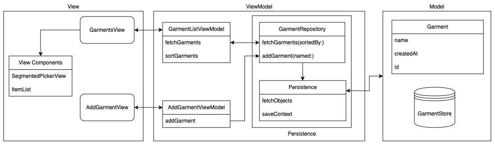
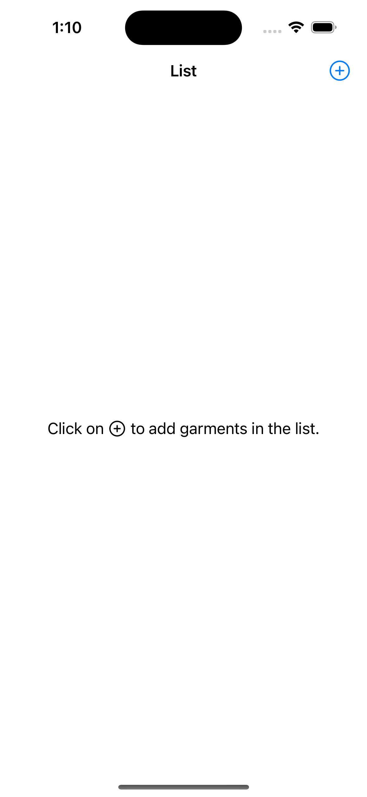
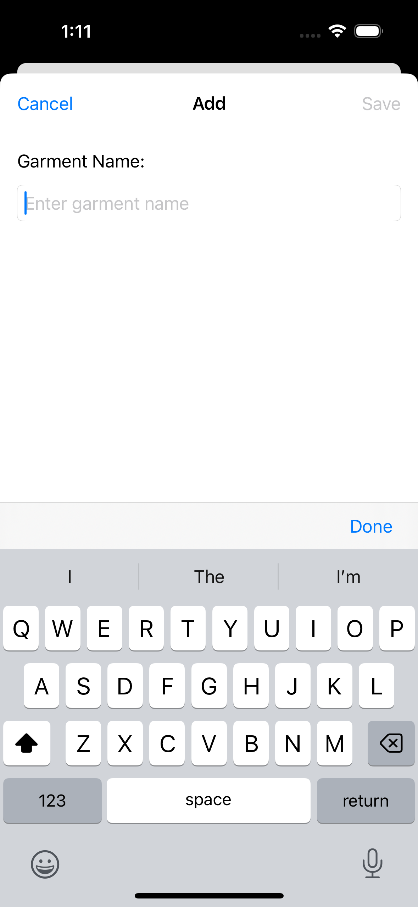
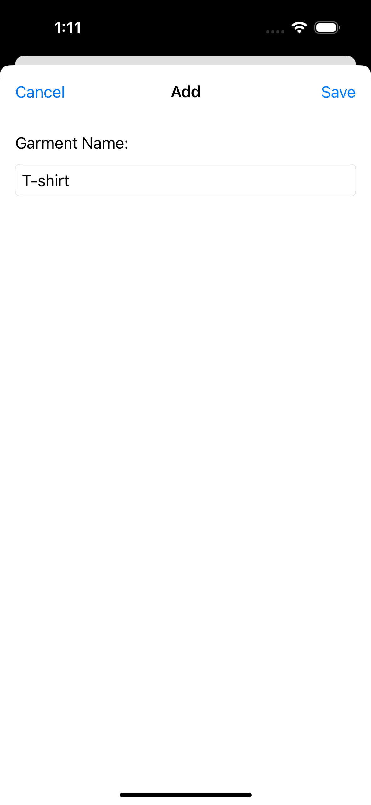
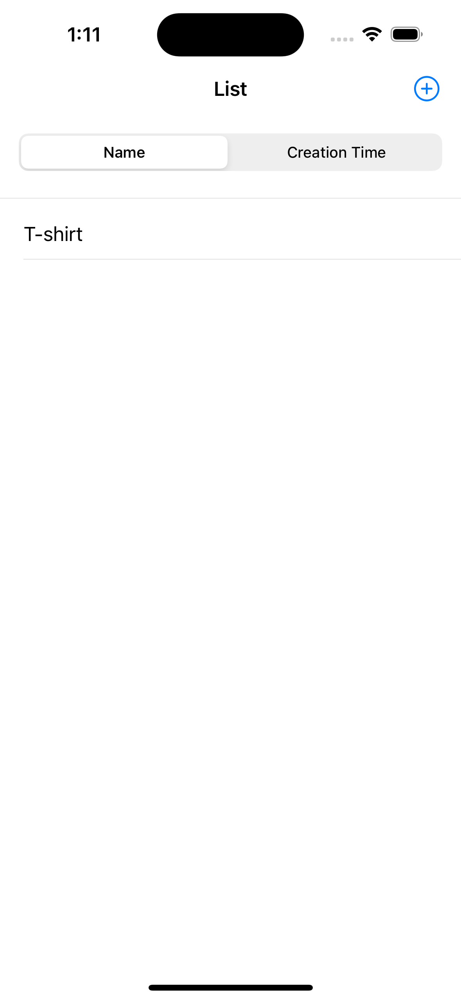
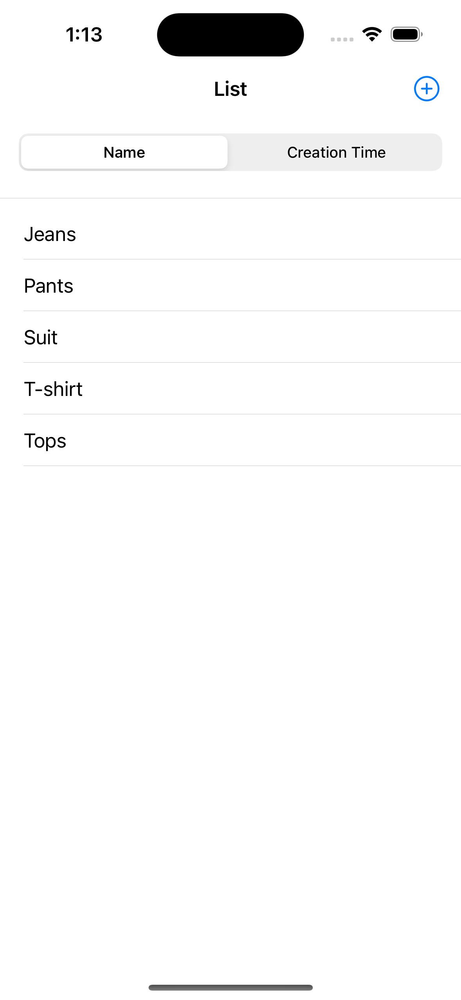
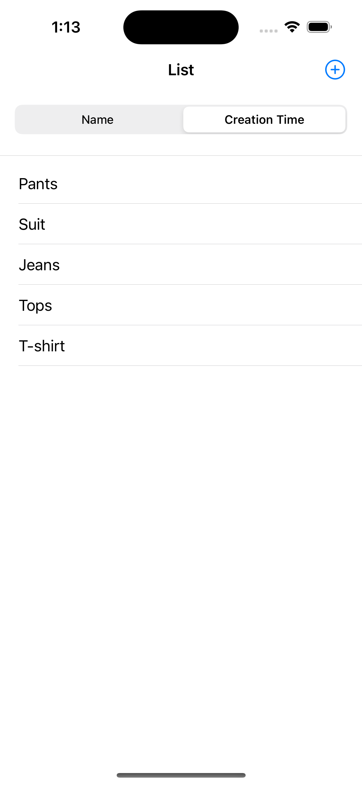

# Lululemon

The App is designed to manage a collection of garments. It allows users to add, and sort garments either alphabetically or by creation time in a list.

## Features Implemented

-   **Garments List**
    
    -   Display a list of added garments from database(CoreData).
    -   Sort list by name or creation time.
    -   "+" icon to present add garment view as a model view. 
    
-   **Add Garment View**
    
    -   Add new garment items to a database with a name and auto-generated timestamp.
    -   Close add garment screen and refresh garment list.

## Implementation Details

### Technologies Used

-   **Development Environment:** Xcode 14.2
-   **Target iOS Version:** iOS 15+
-   **Programming Language:** Swift, SwiftUI
-   **Design Pattern:** MVVM
-   **Persistence:** CoreData
-   **Unit Tests:** XCTest
  
### Architecture

  
## User Interface Screenshots

&nbsp;&nbsp;&nbsp;&nbsp;&nbsp;&nbsp;
  &nbsp;&nbsp;&nbsp;&nbsp;&nbsp;&nbsp;
     
  &nbsp;&nbsp;&nbsp;&nbsp;&nbsp;&nbsp;
  &nbsp;&nbsp;&nbsp;&nbsp;&nbsp;&nbsp;
  &nbsp;&nbsp;&nbsp;&nbsp;&nbsp;&nbsp;

## Additional Notes

-   **Unit Test Cases:** Implemented to ensure code reliability and correctness.
    
-   **Dependency Injection:** Implemented protocols to ensure a flexible and maintainable codebase, facilitating easier testing and future updates.

-   **Direct Commit to `main` branch:** Code was committed directly to the main branch due to being the sole developer, eliminating the need for a Git workflow initially.

### Assumptions
-   **Duplicate items:** Allow duplicate garments in a list.
-   **Update/Delete items:** No update or delete garment item functionality according to requirements.
-   **Validation:** Basic empty validation and whitespace trimming of item name is implemented at the time of adding records to database.

## Future Enhancements
    
-   **Error Management:** Implement better error handling and messaging to enhance user experience and app robustness.
    
-   **Performance Optimization:** Continuously optimize code and UI/UX for smoother and more responsive interactions.
